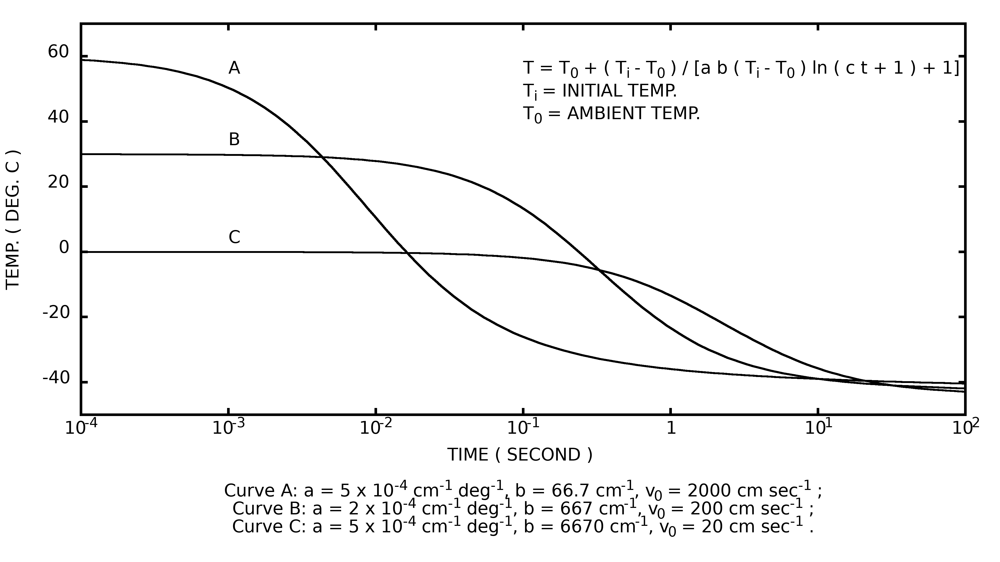
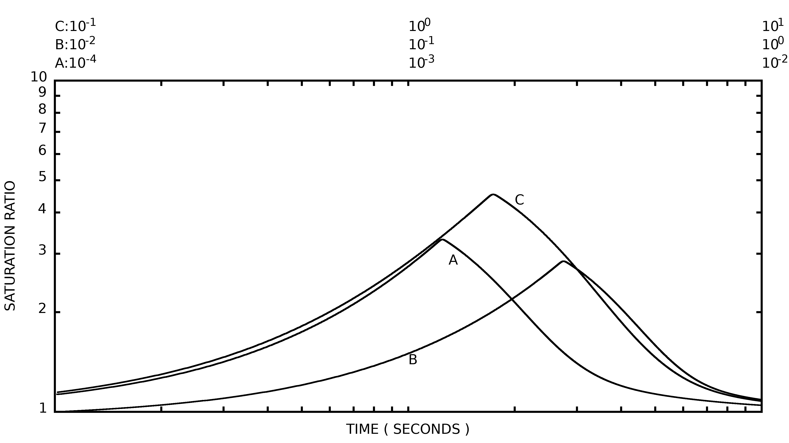

# Huffman-Ice-Fog-Particles-Model
Rebuild the ice fog particles model based on [Huffman, 1971]. This repository is a project of ATM615 (Cloud Physics) from University of Alaska Fairbanks.

## Dependencies
You will need the GNU Fortran compiler (Gfortran) and Gnuplot to compile all the codes. On Ubuntu/Fedora

```shell
sudo apt install gfortran gnuplot
```

```shell
sudo dnf install gfortran gnuplot
```
On Mac OS, use [brew](https://brew.sh/)

```shell
sudo brew install gfortran gnuplot
```

then you are good to go!

## Compile
To compile and run
```shell
./wrapper
```

and use
```shell
./wipper
```
to remove all files generated.

## The original FORTRAN code

The original code was written by FORTRAN. Based on the year the paper was written I assume the code was written by [FORTRAN 66](https://en.wikipedia.org/wiki/Fortran#FORTRAN_66). Thus one should not blame the author for the readibility of the code (which I did in the first place, I apologize for that...). The file `HUFFMAN_1971.F` was copied by me from Dr. Huffman's thesis, so bare with me if there is any typos. Notice that the code needs input files to correctly compile so it is not compilable. I made some comments for the original code so if you are interested in the original code please read them in the folder `src`.

There are two places I found interesting in his original code, :

1. The radius of the droplets is computed through the following codes:

```fortran
      DO 103 N=1,KNT1
      IF(SNEW.LT.1.)SNEW=1.
      ROOT=R(N)**2+2.*(SNEW-1.)*DELTA/U2
      IF(ROOT.LE.0.)GO TO 1103
      R(N)=SQRT(ROOT)
      GO TO 103
```

The equation used in `ROOT=R(N)**2+2.*(SNEW-1.)*DELTA/U2` is derived from Equation 11 of [Rooth, 1957]. The details of the derivation can be found in `HUFFMAN_1971.F` (line 163-201).

2. The stepsize control of the original code is done with two loops, the loop 100 and the loop 101. The details of timestep is presented in the table below:

|T1      |T2       |DELT     |KNOUT    |DELTA    |101  |100  |
|:------:|:-------:|:-------:|:-------:|:-------:|:---:|:---:|
| 1.E-5  |2.E-5    |1.E-5    |1        |1.E-5    |GOTO | -   |
| 2.E-5  |3.E-5    |1.E-5    |2        |1.E-5    |GOTO | -   |
| ...    |...      |...      |...      |...      |...  | -   |
| 89.E-5 |90.E-5   |1.E-5    |89       |1.E-5    |GOTO | -   |
| 90.E-5 |1.E-3    |1.E-5    |90       |1.E-5    | -   |GOTO |
|  -     | -       | -       | -       | -       | -   | -   |
| 1.E-4  |2.E-4    |1.E-4    |1        |1.E-4    |GOTO | -   |
| 2.E-4  |3.E-4    |1.E-4    |2        |1.E-4    |GOTO | -   |
| ...    |...      |...      |...      |...      |...  | -   |
| 89.E-4 |90.E-4   |1.E-4    |89       |1.E-4    |GOTO | -   |
| 90.E-4 |1.E-2    |1.E-4    |90       |1.E-4    | -   |GOTO |
|  -     | -       | -       | -       | -       | -   | -   |
| 1.E-3  |2.E-3    |1.E-3    |1        |1.E-3    |GOTO | -   |
| 2.E-3  |3.E-3    |1.E-3    |2        |1.E-3    |GOTO | -   |
| ...    |...      |...      |...      |...      |...  | -   |
| 89.E-3 |90.E-3   |1.E-3    |89       |1.E-3    |GOTO | -   |
| 90.E-3 |1.E-1    |1.E-3    |90       |1.E-3    | -   |GOTO |
|  -     | -       | -       | -       | -       | -   | -   |
| 1.E-2  |2.E-2    |1.E-2    |1        |1.E-2    |GOTO | -   |
| 2.E-2  |3.E-2    |1.E-2    |2        |1.E-2    |GOTO | -   |
| ...    |...      |...      |...      |...      |...  | -   |
| 89.E-2 |90.E-2   |1.E-2    |89       |1.E-2    |GOTO | -   |
| 90.E-2 |1.       |1.E-2    |90       |1.E-2    | -   |GOTO |
|  -     | -       | -       | -       | -       | -   | -   |
| 1.e-1  |2.e-1    |1.E-1    |1        |1.E-1    |GOTO | -   |
| 2.e-1  |3.e-1    |1.E-1    |2        |1.E-1    |GOTO | -   |
| ...    |...      |...      |...      |...      |...  | -   |
| 89.e-1 |90.e-1   |1.E-1    |89       |1.E-1    |GOTO | -   |
| 90.e-1 |100.e-1  |1.E-1    |90       |1.E-1    |END  |END  |

This is a geneius idea back then because computational power was so limited. But use _1.e-1_ as the timestep in a `DOUBLE PRECISION` program is not acceptable, especially when the equation is [stiff](https://en.wikipedia.org/wiki/Stiff_equation). With no error check, the difference between simulated values and real values will increase dramatically as time increases.

# Some plots made by the rebuilt model

Temperature vs. time plot generated by the model:



Saturation ratio vs. time generated by adeptive stepsize Runge Kutta method:

