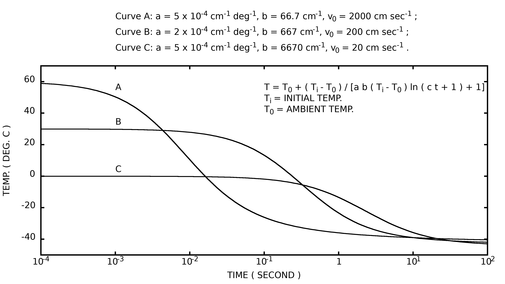

# Huffman-Ice-Fog-Particles-Model
Rebuild the ice fog particles model based on [Huffman, 1971]. This repository is a project of ATM615 (Cloud Physics) from University of Alaska Fairbanks.

## Dependencies
You will need the GNU Fortran compiler (Gfortran) and Gnuplot to compile all the codes. On Ubuntu/Fedora

```shell
sudo apt install gfortran gnuplot
```

```shell
sudo dnf install gfortran gnuplot
```
On Mac OS, use [brew](https://brew.sh/)

```shell
sudo brew install gfortran gnuplot
```

then you are good to go!

## Compile
To compile and run
```shell
./wrapper
```

and use
```shell
./wipper
```
to remove all files generated.

## The original FORTRAN code

The original code was written by FORTRAN. Based on the year the paper was written I assume the code was written by [FORTRAN 66](https://en.wikipedia.org/wiki/Fortran#FORTRAN_66). Thus one should not blame the author for the readibility of the code (which I did in the first place, I apologize for that...). The file `HUFFMAN_1971.F` was copied by me from Dr. Huffman's thesis, so bare with me if there is any typos. Notice that the code needs input files to correctly compile so it is not compilable. I made some comments for the original code so if you are interested in the original code please read them in the folder `src`.

There are two places I found interesting in his original code, :

* The radius of the droplets is computed through the following codes:

```fortran
      DO 103 N=1,KNT1
      IF(SNEW.LT.1.)SNEW=1.
      ROOT=R(N)**2+2.*(SNEW-1.)*DELTA/U2
      IF(ROOT.LE.0.)GO TO 1103
      R(N)=SQRT(ROOT)
      GO TO 103
```

What it means is essentially


$$
r_{i+1}^2 = r_i^2 + \frac{2(S_{i+1}+1)}{u+v}\cdot\Delta t
$$


